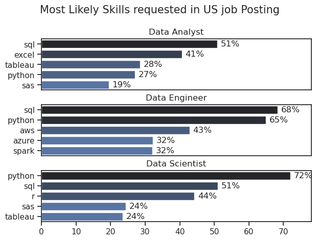

# The Analysis

## What are the skills most in demand for the top 3 most popular data roles?
To find most demanded skills for the top 3 most popular Data roles.I filtered out those positions by which we get the top skills required for these job roles.

view my notebook for detailed steps here:[2_skill_Demand.ipynb](3_Project/2_skill_Demand.ipynb)

## Visualisation Data using seaborn

```python
fig,ax = plt.subplots(len(job_titles),1)
sns.set_theme(style='ticks')

for i,job_title in enumerate(job_titles):
    df_plot = df_skills_perc[df_skills_perc['job_title_short'] == job_title].head(5)
    sns.barplot(data=df_plot,x='skill_percent',y='job_skills',ax=ax[i],hue='skill_count',palette='dark:b_r')
    ax[i].set_title(job_title)
    ax[i].set_ylabel('')
    ax[i].set_xlabel('')
    ax[i].get_legend().remove()
    ax[i].set_xlim(0,78)

    for n,v in enumerate(df_plot['skill_percent']):
        ax[i].text(v + 1,n,f'{v:.0f}%',va='center')

    if i != len(job_titles) - 1:
        ax[i].set_xticks([])

fig.suptitle('Most Likely Skills requested in US job Posting',fontsize=15)
fig.tight_layout(h_pad=0.5) #fixing the overlap
plt.show()
```
### Result



### Insights
- Python is a versatile skill,highly demanded across all the three roles
- SQL is most demanded skill for Data Analyst and Data Scientist,with it in over half
-Data Engineer require more specialized technical skills(aws,azure,spark) as compared to Data Analyst and Data Scientist who needs to be more proficient in data managment and analysis tools (Tableau,Excel).