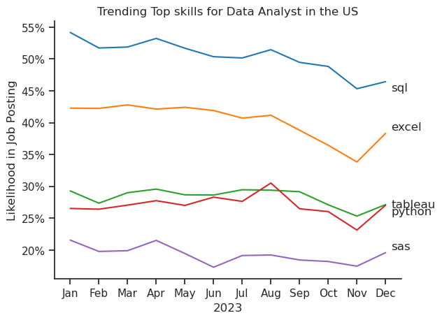
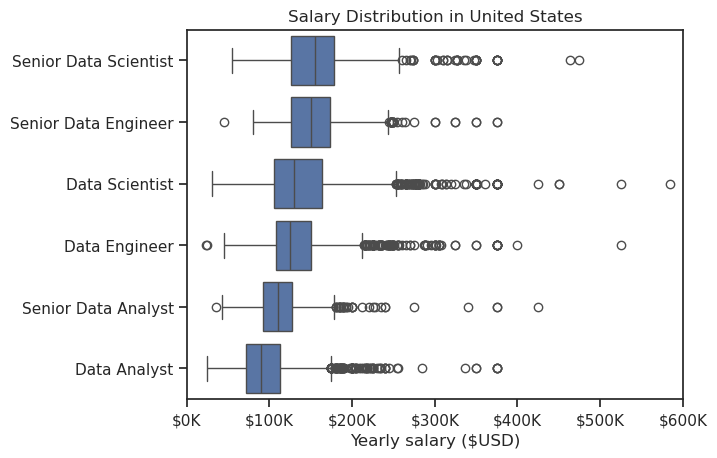
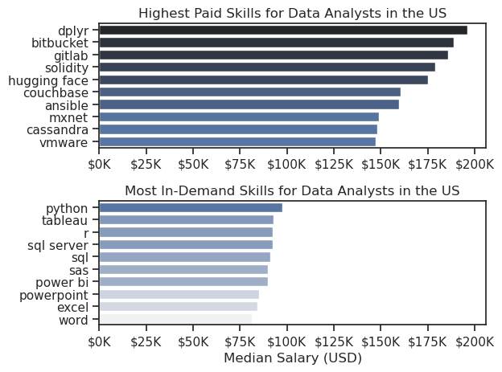
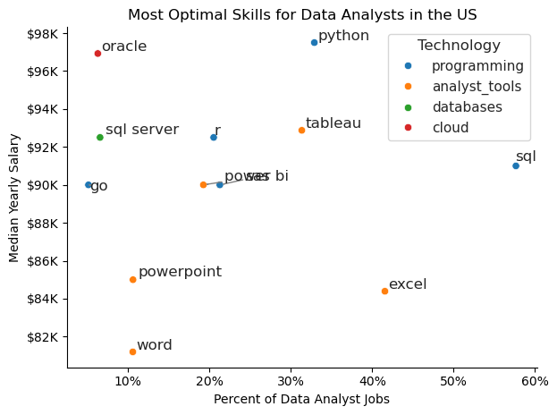

# The Analysis

## What are the skills most in demand for the top 3 most popular data roles?
To find most demanded skills for the top 3 most popular Data roles.I filtered out those positions by which we get the top skills required for these job roles.

view my notebook for detailed steps here:[2_skill_Demand.ipynb](3_Project/2_skill_Demand.ipynb)

## Visualisation Data using seaborn

```python
fig,ax = plt.subplots(len(job_titles),1)
sns.set_theme(style='ticks')

for i,job_title in enumerate(job_titles):
    df_plot = df_skills_perc[df_skills_perc['job_title_short'] == job_title].head(5)
    sns.barplot(data=df_plot,x='skill_percent',y='job_skills',ax=ax[i],hue='skill_count',palette='dark:b_r')
    ax[i].set_title(job_title)
    ax[i].set_ylabel('')
    ax[i].set_xlabel('')
    ax[i].get_legend().remove()
    ax[i].set_xlim(0,78)

    for n,v in enumerate(df_plot['skill_percent']):
        ax[i].text(v + 1,n,f'{v:.0f}%',va='center')

    if i != len(job_titles) - 1:
        ax[i].set_xticks([])

fig.suptitle('Most Likely Skills requested in US job Posting',fontsize=15)
fig.tight_layout(h_pad=0.5) #fixing the overlap
plt.show()
```
### Result


### Insights
- Python is a versatile skill,highly demanded across all the three roles
- SQL is most demanded skill for Data Analyst and Data Scientist,with it in over half
-Data Engineer require more specialized technical skills(aws,azure,spark) as compared to Data Analyst and Data Scientist who needs to be more proficient in data managment and analysis tools (Tableau,Excel).

## 2. How are in-demand skills trending for Data Analysts?

### Visualize Data
```python
df_plot = df_DA_US_percent.iloc[:, :5]

sns.lineplot(data=df_plot,dashes=False,palette='tab10')
sns.set_theme(style='ticks')
sns.despine()

plt.title('Trending Top skills for Data Analyst in the US')
plt.xlabel('2023')
plt.ylabel('Likelihood in Job Posting')
plt.legend().remove()

from matplotlib.ticker import PercentFormatter
ax = plt.gca()
ax.yaxis.set_major_formatter(PercentFormatter(decimals=0))

for i in range(5):
    plt.text(11.2,df_plot.iloc[-1,i],df_plot.columns[i])
```

### Results



### Insights
- The line plot displays the trends for the top 5 skills required for data analysts in the US throughout 2023. It helps identify which skills have been consistently in demand and which ones have fluctuated.
- SQL is shown at the top of the chart with the highest likelihood in job postings throughout 2023, indicating it is the most demanded skill for data analysts.
Excel is also in high demand, consistently maintaining a significant presence just below SQL
- Python shows a moderate and consistent presence across the year, indicating it is also an important skill but not as highly demanded as SQL or Excel.
Tableau and SAS have lower demand comparatively, with SAS consistently being the least demanded among the five.


## 3.How well the jobs and skills pay for Data Analyst?

### Salary analysis for Data Nerds

### Visualise Data
```python
sns.boxplot(data=df_US_top6,x='salary_year_avg',y='job_title_short',order=job_order)
sns.set_theme(style='ticks')

plt.title('Salary Distribution in United States')
plt.xlabel('Yearly salary ($USD)')
plt.ylabel('')
ax = plt.gca()
ax.xaxis.set_major_formatter(plt.FuncFormatter(lambda x,pos: f'${int(x/1000)}K'))
plt.xlim(0,600000)
plt.show()
```

### Results


### Insights
- Senior Data Scientists have the highest earning potential, with salaries frequently exceeding $200K.
- Senior positions generally have wider salary ranges, indicating more variability based on experience, location, and other factors.
Data Analysts earn the least on average, with a much narrower range of salaries compared to senior roles.


### Highest Paid & Most Demands Job Skills for Data Analysts

### Visualise Data
```python
fig, ax = plt.subplots(2, 1)  

# Top 10 Highest Paid Skills for Data Analysts
sns.barplot(data=df_DA_top_pay, x='median', y=df_DA_top_pay.index, hue='median', ax=ax[0], palette='dark:b_r')
ax[0].legend().remove()
# original code:
# df_DA_top_pay[::-1].plot(kind='barh', y='median', ax=ax[0], legend=False) 
ax[0].set_title('Highest Paid Skills for Data Analysts in the US')
ax[0].set_ylabel('')
ax[0].set_xlabel('')
ax[0].xaxis.set_major_formatter(plt.FuncFormatter(lambda x, _: f'${int(x/1000)}K'))


# Top 10 Most In-Demand Skills for Data Analysts')
sns.barplot(data=df_DA_skills, x='median', y=df_DA_skills.index, hue='median', ax=ax[1], palette='light:b')
ax[1].legend().remove()
# original code:
# df_DA_skills[::-1].plot(kind='barh', y='median', ax=ax[1], legend=False)
ax[1].set_title('Most In-Demand Skills for Data Analysts in the US')
ax[1].set_ylabel('')
ax[1].set_xlabel('Median Salary (USD)')
ax[1].set_xlim(ax[0].get_xlim())  # Set the same x-axis limits as the first plot
ax[1].xaxis.set_major_formatter(plt.FuncFormatter(lambda x, _: f'${int(x/1000)}K'))

sns.set_theme(style='ticks')
plt.tight_layout()
plt.show()
```

### Results


### Insights
- The top three highest-paid skills for Data Analysts are "dplyr," "bitbucket," and "gitlab," each associated with median salaries nearing or exceeding $150K. These skills, often linked to specialized data manipulation (dplyr) and version control (bitbucket, gitlab), command higher salaries likely due to their niche usage and importance in complex data analysis tasks
- The most in-demand skills for Data Analysts are "python," "tableau," and "R." These skills are highly sought after by employers, suggesting a strong need for data analysts proficient in these areas. However, the median salary for these skills is slightly lower (between $75K and $100K) compared to the highest-paid skills, reflecting their broader adoption and application across many job roles.
-  There is a noticeable discrepancy between the highest-paid and most in-demand skills. While "python" and "tableau" are in high demand, they are not among the highest-paid skills. This gap suggests that while these tools are essential for many data analysis jobs, the market may offer premium salaries for more specialized or less commonly possessed skills.


## What is the most optimal skill to learn for Data Analyst?

### Visualise Data
```python
sns.scatterplot(
    data=df_DA_skills_tech_high_demand,
    x='skill_percent',
    y='median_salary',
    hue='technology'
)

sns.despine()
sns.set_theme(style='ticks')

# Prepare texts for adjustText
texts = []
for i, txt in enumerate(df_DA_skills_high_demand.index):
    texts.append(plt.text(df_DA_skills_high_demand['skill_percent'].iloc[i], df_DA_skills_high_demand['median_salary'].iloc[i], txt))

# Adjust text to avoid overlap
adjust_text(texts, arrowprops=dict(arrowstyle='->', color='gray'))

# Set axis labels, title, and legend
plt.xlabel('Percent of Data Analyst Jobs')
plt.ylabel('Median Yearly Salary')
plt.title('Most Optimal Skills for Data Analysts in the US')
plt.legend(title='Technology')

from matplotlib.ticker import PercentFormatter
ax = plt.gca()
ax.yaxis.set_major_formatter(plt.FuncFormatter(lambda y, pos: f'${int(y/1000)}K'))
ax.xaxis.set_major_formatter(PercentFormatter(decimals=0))

# Adjust layout and display plot 
plt.tight_layout()
plt.show()
```

### Result


### Insights
- Python is the only skill that's plotted at the top of the chart, indicating it's the most in-demand skill among data analysts.
This aligns with the growing popularity of Python for data analysis due to its versatility and extensive libraries.
- SQL is consistently plotted near the center of the chart, suggesting it's a core skill that most data analysts need.
This is because SQL is essential for interacting with databases, which are a fundamental component of data analysis.
- While technical skills like Python and SQL are crucial, soft skills like Excel and PowerPoint are also represented on the chart.
This highlights the importance of communication and data visualization skills in the field of data analysis.